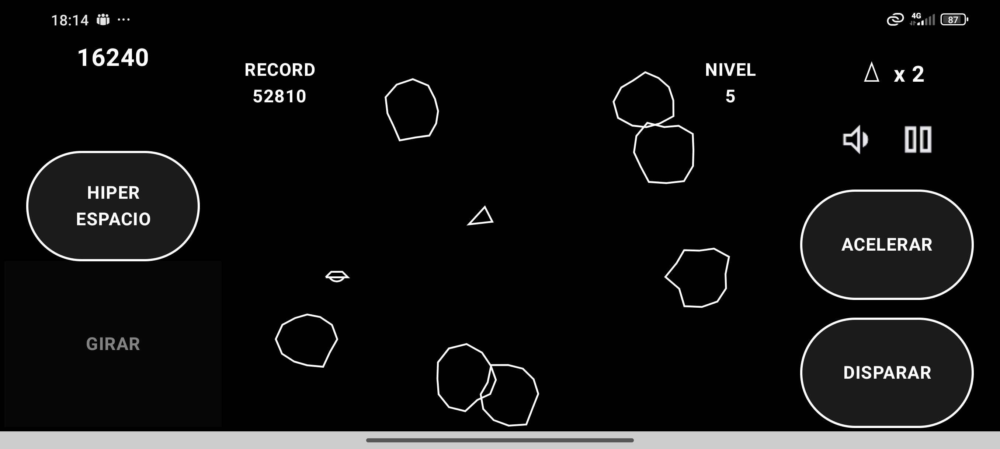
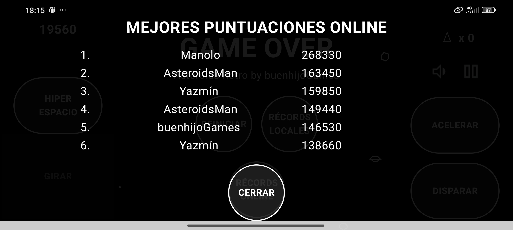

# Asteroids - Remake para Android

Un remake moderno del clásico juego de arcade "Asteroids" de 1979, desarrollado nativamente para Android con Kotlin, Jetpack Compose y un motor de renderizado sobre Canvas.




## Sobre el Juego

Este proyecto reimplementa el icónico juego de arcade, manteniendo su jugabilidad clásica pero añadiendo características modernas como autenticación de usuarios y una tabla de puntuaciones global en tiempo real usando Firebase.

El objetivo es simple: controlar una nave en un campo de asteroides, destruirlos para sumar puntos y sobrevivir el mayor tiempo posible evitando colisiones y el ataque de naves OVNI.

Además del modo clásico, el proyecto está diseñado para soportar un modo de juego alternativo llamado **"Crossroad"**, donde la nave debe navegar por una carretera que se genera proceduralmente, añadiendo un nuevo nivel de desafío.

## Características

- **Jugabilidad Clásica:** Movimiento con inercia, rotación, aceleración y la habilidad de teletransportarse (hiperespacio).
- **Sistema de Puntuación:** Puntos por destruir asteroides y OVNIs, con vidas extra al alcanzar ciertos hitos.
- **Autenticación de Usuarios:** Soporte para inicio de sesión con **Google Sign-In** y **Email/Contraseña** a través de Firebase Authentication.
- **Tabla de Puntuaciones Global:** Las mejores puntuaciones se guardan en Firebase Firestore, creando un ranking en tiempo real.
- **Enemigos Variados:**
    - Tres tamaños de asteroides (grandes, medianos, pequeños) que se dividen al ser destruidos.
    - Dos tipos de OVNIs (grandes y pequeños) con diferentes patrones de ataque y dificultad.
- **Controles Táctiles:** Paneles de control en pantalla optimizados para dispositivos móviles.
- **Efectos Visuales y de Sonido:** Explosiones, disparos y sonidos que recrean la atmósfera del juego original.
- **Modo "Crossroad":** Un modo de juego alternativo donde el movimiento está restringido a una carretera curva generada proceduralmente.

## Pila Tecnológica

- **Lenguaje:** [Kotlin](https://kotlinlang.org/)
- **Interfaz de Usuario (UI):** [Jetpack Compose](https://developer.android.com/jetpack/compose) para los menús y la interfaz, y [Android Canvas](https://developer.android.com/guide/topics/graphics/draw-with-canvas) en un `SurfaceView` para el renderizado del juego en tiempo real.
- **Arquitectura:** MVVM (Model-View-ViewModel).
- **Backend y Servicios:** [Firebase](https://firebase.google.com/)
    - **Firebase Authentication:** Para la gestión de usuarios.
    - **Firebase Firestore:** Para la base de datos de puntuaciones.
- **Build System:** [Gradle](https://gradle.org/)

## Arquitectura del Juego

El proyecto sigue una arquitectura MVVM adaptada para un juego, separando la lógica del estado, la vista y la entrada del usuario.

```
com.buenhijogames.asteroid/
├── modelo/           # Clases de datos y estado del juego (EstadoJuego, EstadoNave)
├── ui/               # Componentes de UI con Jetpack Compose (Overlays, Controles)
├── auth/             # Lógica de autenticación con Firebase
├── MotorJuego.kt     # Lógica principal del juego (actualizaciones, colisiones)
├── JuegoViewModel.kt # Conecta la UI con el motor del juego y Firebase
└── JuegoSurfaceView.kt # Renderiza el estado del juego en el Canvas
```
